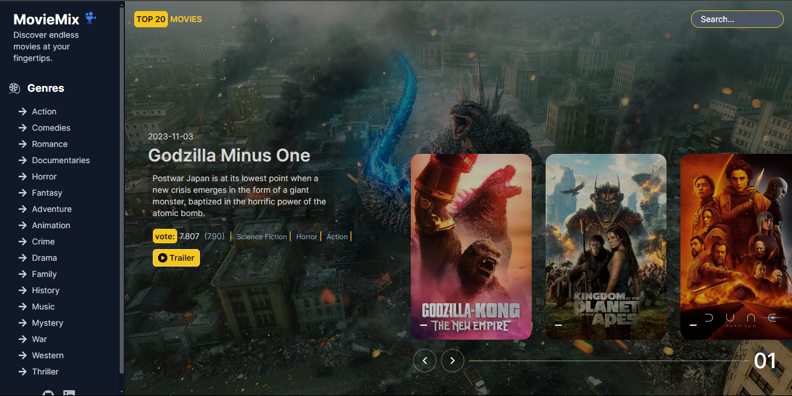

# Movie App with Next.js



## About the project

It's a movie app built with Next.js

## Instalation

- Clone the repository:

```JavaScript
git clone git clone git@github.com:ab-sharifi21/MovieMix.git

```

- Install the dependencies

```JavaScript
npm install
```

- Create .env.local file and indicate your API_KEY

```JavaScript
VITE_API_KEY=your api key
```

- Start the application

```JavaScript
npm run dev
```

## Installation


